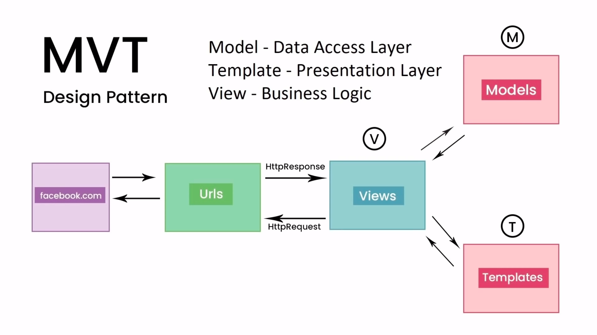

# Python + Django

## What is Django ?

* It is Python based web framework.
* Server side framework.
* Designed to get you started fast
* Batteries included.
* MVT Design pattern

## What is a web framework ?

collection of modules,packages, and libraries designed to speed up development.

## What can you build with Django ?

we can build e-commerce websites, mobile apps like instagram , udemy .. etc

* Building API's with Django is easy!

* other python frameworks

1. Flask
2. Cherry pie
3. web2py
4. pyramid

* Django follows MVT Design pattern.

